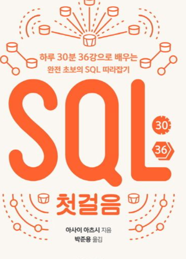

# 📝 Study
### 정리하는 이유
안해놓으면 까먹기 때문에 어떤거 참고해서 공부했는지
 

### 탐색 

🔥Main > java \
ㄴ 🔥Spring frame work\
프로그래머스 코딩 테스트

🔥databases\
***데이터 중심 애플리케이션 설계*** 핵심 요약\

위 책 많이 참고함.

🔥docker\
    ㄴ  🔥[kubernetes](https://www.youtube.com/watch?v=s_o8dwzRlu4&list=PLMrkKyjG4Vpe45DDZmDVnyvk8myF8EJNq&index=1&t=268s) 주로 이 영상 보고 공부했던 내용.

🔥[Linuix](https://www.udemy.com/course/linux-command-line-colt/)관련 강의 영상 \
ㄴ 🔥manual, navigation, fire creation

🔥정처기 \
ㄴ 🔥정처기 필기 1~5과목 정리
