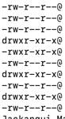

## 시스템 탐색

### root 디렉토리
최상위(root) 디렉토리 개념 존재.\
우리가 일반적으로 보는 파일 탐색기는 GUI환경. open 명령어를 통해 열 수 있음.

open directory를 적으면 파일창이 열리게됨.
open / 은 최상위 다이렉트를 확인해볼 수 있음

### home 디렉토리
홈 안에 파일은 사용자를 의미한다.

    / - root 최상단 기호
    ~ - home 최상단 기호

### pwd 명령어

현재 위치에 대한 정보를 제공해주는 명령어이다.

### ls 명령어

list를 뜻하는 명령어. 디렉토리 안에 내용을 보고 싶을 때 사용합니다.

    ls 파일 또는 그냥 ls 하면 현재 디렉토리 안에 있는 내용을 검색해준다.

#### -l 옵션 응용
long으로 출력하라는 뜻.

그러면 권한에 대해서도 확인 가능하다.

#### -a 옵션 응용
all 모든 파일을 확인시켜준다.(숨겨진 파일까지)
#### -al 옵션 응용
모든 파일에 대한 권한을 확인 시켜준다.

#### -h 옵션
사람이 읽기 쉽게 출력시켜준다.

#### -s sort기능을 가졌다.

### cd 명령어

상대경로와 절대 경로

cd를 통해 파일 안쪽 끝까지 들어가다 보면

.과 ..을 찾아 볼 수 있다.

    .은 현재 루트
    ..은 상단 루트를 가리킨다.

상대경로는 ..와 . 를 통해 사용하고
절대경로는 루트 경로(/)부터 모든 경로를 명시해주는것.

예를 들어 상대경로는

    cd ../../ 두번 올라가라는 뜻
    cd animals/cats/ 디렉토리에서 cd ../dogs 를 하면
    animals 상단 폴더 이동 후 dogs파일로 이동

그리고 절대경로는

    cd /home/user/documents : /home/user/documents 디렉토리로 이동합니다.

위와 같이 활용.

파일 개수 확인

    ls | wc -l
ls로 현재 파일 확인 출력 결과 wc -l 명령어로 체크

[실습은 여기서](https://plum-poppy-0ea.notion.site/Navigation-Exercise-cfabfffd1fc04c22a76b6e3ebb60a4ca)
