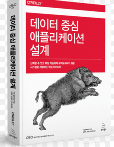

내가 이책을 배워야겠다고 생각한 이유: 백엔드 개발자는 데이터를 가장 많이 다루는 직군인데
단순히 CRUD작업만 하는것이 아니라 데이터를 잘 알아야 한다는 이야기를 많이 들었습니다.

그래서 부족한 부분을 채우기 위해 이 책의 내용을 공부하기로 했습니다.

## 데이터 중심 애플리케이션 설계

### 이책에서 다루는 내용들
데이터 시스템 아키텍처와 데이터 중심 애플리케이션 데이터 시스템을 통합하는 방법

1부: 근본 개념 신뢰성, 확장성, 유지보수성

⭐2부: 분산 데이터 저장
* 현재 내가 알고있는 분산데이터 저장 기술: kafka, 비관적락과 낙관적 락

3부: 파생하는 시스템

------------------------

## 7장 트랜잭션

***냉혹한 현실에서 데이터 시스템이 일으키는 여러가지 문제***

* 쓰기연산 읽기 연산은 언제든지 실패할 수 있다.
* 애플리케이션은 연산이 실행되는 도중이라도 언제든 죽을 수 있다.
* 네트웤이 끊기면 DB연결 끊기거나 노드 사이의 통신이 안 될수 있다.
* 여러 클라이언트가 동시에 쓰기를 실행해서 다른 클라이언트가 쓴 내용을 덮어 쓸 수 있다.
* 부분적으로만 갱신되어 비정상적인 데이터를 읽을 수 있다.

잘못될 수 있는 모든것에 대해 신중하게 생각해서 테스트를 여러번하고 해결책이 실제로 동작하는지 확인해야한다.

### [ACID란?](https://github.com/JaeKang20/Study/blob/main/src/main/resources/templates/databases/ACID.md)

### 단일객체 연산과 다중 객체 연산

**다중 객체 트랜잭션**은 흔히 데이터의 여러 조각이 동기화된 상태로 유지돼야 할 때 필요하다.

어떤 사용자가 읽지 않은 메시지 개수를 보여주려면 아래 쿼리를 따른다
~~~
select count(*) from emails where recipient_id = 2 and unread_flag = true
~~~
이메일이 만약 너무 많다면 질의가 너무 느려서 읽지 않은 메시지 개수를 별개의 필드에 저장하고 싶을것이다(정규화)\
이제 새로운 메시지가 왔다면 개수를 증가시키고, 메시지를 읽으면 읽지 않은 메시지 개수도 감소시켜야한다.

격리성이 위반된 상황에서 그럼 사용자는 이상한 현상을 경험할 수있다. 우편함 목록에 읽지 않은 메시지가 하나 있지만 읽지 않은 메시지 개수는 아직 증가되지 않아서\
읽지 않은 메시지 개수는 0으로 나올 수 있다.

다중객체 트랜잭션은 어떤 읽기 연산과 쓰기 연산이 동일한 트랜잭션에 속하는지 알아낼 수단이 있어야한다.

### 단일 객체 쓰기