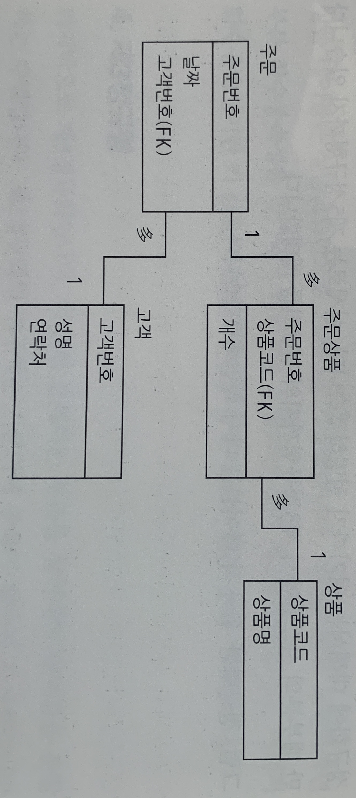

## 정규화

데이터베이스가 대충 만들어 졌다면 단계별로 정규화 시키는게 중요하다.
정규화는 정처기를 통해 배웠던 내용이라 친숙하다.

### 대충 만들어진 데이터 베이스
관계형 데이터 베이스는 하나의 셀에 하나의 값만 저장한다.
두개의 데이터를 한 셀에 넣은 다면 정규화가 필요.

### 1정규형
반복되는 데이터를 가로가 아닌 세로로 늘리는것이 1정규화 1단계
제 1정규화에서 테이블 분할과 기본키(PK)지정 이뤄진다.

### 2정규형
완전 함수적 종속성 관계 제거\
함수적 종속성 관계란 하나의 키값을 통해 데이터를 특정 지을 수 있는것을 가리킴.

PK로 지정된 데이터들중에서 종속성 관계를 제거해준다.

ex) [주문 상품] 테이블의 상품코드와 상품명이 있다.
이때 상품 코드만 보더라도 상품명을 알 수 있기 때문에 [상품] 테이블을 따로 생성해서 상품명은
[주문 상품] 테이블에서 제거해준다.

[주문상품] 테이블 수정 전

| 주문번호 | 상품코드 | 상품명 | 개수 |
|------|------|---|----|
| 1    | 0001 | A | 1  |
| 1    | 0002 | B | 10 |

[주문상품] 수정 후

| 주문번호 | 상품코드 | 개수 |
|------|------|----|
| 1    | 0001 | 1  |
| 1    | 0002 | 10 |

[상품] 테이블 추가

| 상품코드 | 상품 |
|------|----|
| 0001 | A  |
| 0002 | B  |
| 0003 | C  |

### 3정규형
3정규형은 이행 함수 종속성 제거한다. 쉽게말해 2정규형에서 PK값에서 중복된 부분을 제거했다면\
3정규형에서는 그 이외에 부분에서 중복된 부분을 제거해주는 것이다.

[주문] 테이블 수정 전

| 주문번호 | 날짜  | 성명  | 연락처      |
|------|-----|-----|----------|
| 1    | 1/1 | 박준용 | 010-xxxx |
| 2    | 2/1 | 김재진 | 016-xxxx |
| 3    | 2/5 | 박준용 | 010-xxxx |

같은 사람이 반복해서 주문했다. 중복 제거해주자.

[주문] 테이블 수정 후

| 주문번호 | 날짜  | 고객번호 |
|------|-----|------|
| 1    | 1/1 | 1    |
| 2    | 2/1 | 2    |
| 3    | 2/5 | 1    |

[고객] 테이블 추가

| 고객번호 | 성명  | 연락처      |
|------|-----|----------|
| 1    | 박준용 | 010-xxxx |
| 2    | 김재진 | 016-xxxx |

이렇게 테이블 끼리의 연계를 ER다이어그램으로 표현해볼 수 있습니다.

### 정규화의 목적