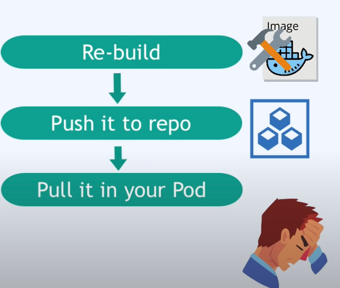

## ConfigMap & Secret

### ConfigMap 필요성

팟은 서비스를 통해 서로 통신합니다. 내 앱은 데이터베이스와 통신하기 위해
명명된 데이터베이스 *엔드포인트*가 있을 것입니다. 이를 앱내의 환경변수에 보통 저장합니다.

그러나 DB URL이 변경된다면 이를 조정해야 합니다.

보통 새로운 앱을 빌드하고 배포하면 새 이미지를 팟 내로 가져와 전체 시스템을 새로 다시 시작해야합니다.
\
이와 같은 경우를 위해 쿠버네티스에서 **'ConfigMap'** 을 사용합니다.

### ConfigMap
외부 설정을 담당합니다. DB URL이나 다른 서비스의 URL와 같은 설정 데이터, 팟이 ConfigMap이 담고 있는 데이터를 가져 올 수 있도록 합니다.

서비스의 이름이나 엔드포인트를 변경한다면 새 이미지를 빌드하거나 번거로운 과정을 거치지 않고

ConfigMap을 조정하면 된다.

### Secret
씨크릿도 컨피그 맵과 크게 다를바가 없다. 비밀번호나 기타 인증정보를 평문으로 저장하는것이 보안상 취약할 수 있으니

이에 대해 쿠버네티스에서 **'Secret'** 을 지원해준다 ConfigMap과 비슷하지만 보안이 중요한 내용을 넣는다.

그리고 Config Map과 같이 Secret도 팟에 연결해서 팟이 데이터를 볼 수 있도록 연결해줍니다.

이렇게 저장된 데이터는 환경변수나 속성 파일로 앱내에서 사용 가능합니다.
