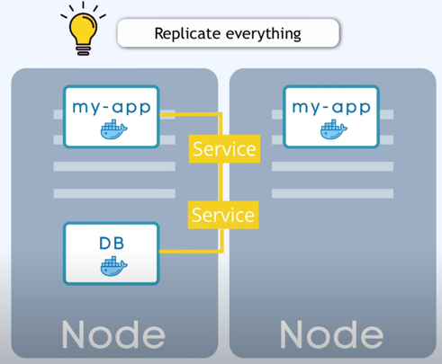
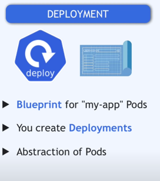
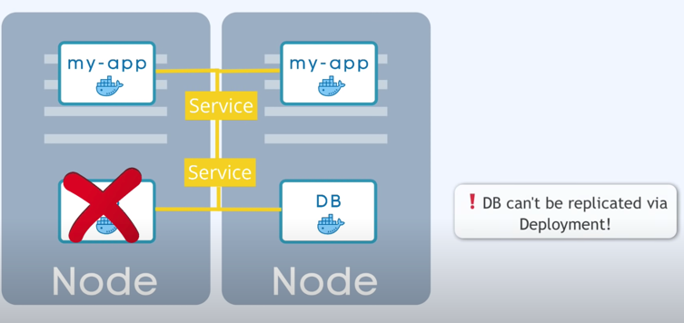
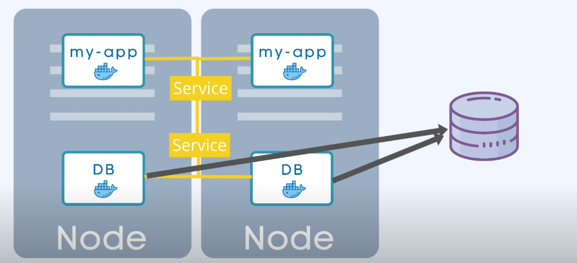
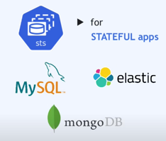
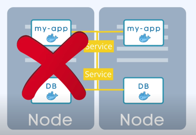

## Deployment & Stateful Set_replication

### 장애 대응
만약 앱의 팟이 다운되거나 죽은 경우 사용자는 앱에 접근할 수 없습니다.

이러한 분산시스템과 컨테이너의 장점으로 App Pod와 DB Pod등은 하나의 파트만을 의존하는 대신
여러 서버에 복제합니다.

다른 노드에 앱 복제본이 실행되며, 이 복제본도 서비스에 연결됩니다.

이전에 설명처럼 IP주소를 사용하고 로드밸런싱 역할을 합니다.( 현재 가장 바쁘지 않은 파드로 전달)

이를위해 ***블루 프린트***란 것을 지정해주어야 합니다. 

그리고 이 블루프린트를 <h3>Deployment</h3>라고 부릅니다.

실제로 두 번째 파드를 생성하는 대신 배포를 생성하고 관리할 것입니다.
배포를 통해 몇 개의 복제본을 실행할지 지정하고 필요에 따라 스케일을 조정할 수 있습니다.
배포에서는 얼마나 많은 복제본을 실행할지 지정할 수 있으며, 필요한 경우 복제본의 수를 확장하거나 축소할 수도 있습니다.

### 그런데 여기 문제가 하나 있습니다.
\

App은 복제가 가능하지만 DB는 복제가 안됩니다.

### 데이터베이스와 StatefulSet
그 이유는 데이터베이스는 상태를 가지고 있기 때문입니다.

    헷갈린다면 자바에서 클래스안에 멤버변수 생각.

다시말해 데이터베이스의 클론이 있다면 모두 동일한 공유 데이터 저장소에 접근해야 하며 이를 위해서
현재 어떤 부분이 해당 저장소에서 쓰고 있는지 읽고 관리하는지 매커니즘이필요합니다.

이 메커니즘을 레플리케이션(복사) 기능과 함께 쿠버네티스 컴포넌트인 **StatefulSet**에서 제공됩니다.

MySQL,MongoDB,ElasticSearch와 같은 상태를 유지하는 DB경우, StatefulSet을 사용해야합니다.\
\
Deployment와 같이 팟을 복제하고 스케일업 스케일 다운을 처리합니다. 
* 주요 차이점은 DB 읽기와 쓰기가 동기화 되도록 관리한다는 점입니다. 그러면 DB가 불일치되는 일을 방지할 수 있습니다.

* Stateless => Deployment
* StatefullSet => Stateful Apps or Databases

#### 알고 넘어가야 할 부분
StatefulSet을 통해 데이터베이스를 배포하는것은 다소 복잡할 수 있습니다.

    그래서 데이터베이스 애플리케이션을 쿠버네티스 클러스터 외부에 호스팅하고
    deployments나 stateless Apps은 쿠버네티스 클러스터 내에서 문제 없이 복제 및 확장되며
    외부 데이터베이스와 통신하게 하는 것이 일반적인 관행입니다.

\

두개의 노드(팟)로 두개의 앱, 두개의 DB가 존재하며 한쪽이 충돌이 생겨 서버 죽더라도
나머지 하나에서 실행이 멈추지 않습니다.

