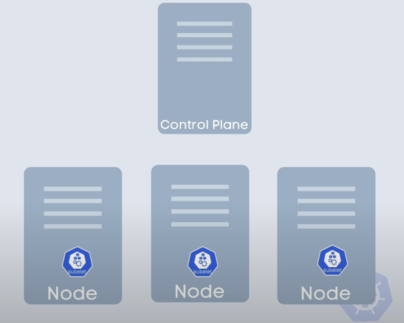
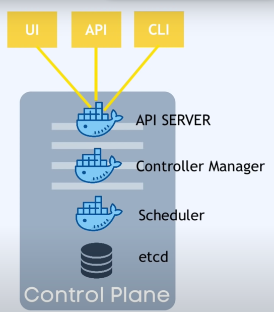

어떻게 애플리케이션 배포를 쉽고 빠르게 해줄까? 그건 도커 이미지를 생성해서 어느 컨테이너든 동일하게 실행하게 하면 해결될 것입니다.
애플리케이션 배포에 필요한 환경변수, 언어, 프레임워크, 운영 시스템을 일관되게 관리해줍니다.

하지만 도커는 운영환경을 관리하기에 어렵습니다. 부하가 많은 시즌에 시스템을 운영할때 시스템을 자동적으로 늘려주거나 특정 앱이 고장나면 대체해주거나 등..

이런 작업들은 쿠버네티스를 통해 해결할 수 있습니다.
쿠버네티스는 여러 서버를 통합 관리하고 필요에 따라 자동으로 리소스를 조정하는 기능을 제공합니다.

명령어 몇 개만으로 인스턴스를 추가하거나 *로드밸런싱을 수행할 수 있습니다.
새로운 버전을 안정적으로도 배포할 수 있죠.

쿠버네티스의 또 다른 놀라운 특징은 그 확장성입니다. 수천 개의 인스턴스와 마이크로서비스를 관리할 수 있습니다. 이를 통해, 쿠버네티스는 애플리케이션을 매우 큰 규모로 확장하는 것을 가능하게 합니다.

AWS, Azure, Google Cloud와 같은 다양한 클라우드 플랫폼에서 쿠버네티스를 실행할 수 있습니다. 이는 쿠버네티스가 다양한 환경에서 작동하는 데 유연함을 제공합니다.
저는 GKE 구글 쿠버네티스 엔진을 GCP에서 실행해봄으로 실행시켜보겠습니다.

 * 로드밸런싱: 네트워크 트래픽을 여러 서버나 리소스 간에 균등하게 분배하는 기술

## [쿠버네티스 한시간에 끝내기](https://www.youtube.com/watch?v=s_o8dwzRlu4&list=PLMrkKyjG4Vpe45DDZmDVnyvk8myF8EJNq&index=1)

#### 쿠버네티스 공식 지정
- 오픈소스 컨테이너를 지휘하는 툴
- 구글사에서 개발
- 서로 다른 환경의 개발 컨테이너 앱서비스를 관리하는데 도와준다.

#### 쿠버네티스는 어떤 문제를 해결할까
- 높은 사용성과 다운타임이 사라진다.
- Scalability 증가로 서비스 부하 대응 좋아짐 (high load, Scale up)
- Disaster recovery - baack up and restore.

### 쿠버네티스 아키텍처

**쿠버네티스 클러스터는 최소한 하나의 마스터 노드로 구성됩니다.**
이 마스터 노드와 연결되어 여러 개의 워커 노드가 있습니다.\

각 노드에는 '큐블릿(Kubelet)' 프로세스가 실행되며,**큐블릿은 실제로 쿠버네티스 클러스터 내의 노드 간 통신과 작업 실행을 가능하게 하는 쿠버네티스 프로세스입니다.**

워커 노드마다는 다양한 애플리케이션 컨테이너가 배포되며, 작업 부하에 따라 워커 노드에서 실행되는 도커 컨테이너의 수가 달라집니다.

**실제 작업이 이루어지는 곳은 바로 워커 노드입니다.** 여기서 애플리케이션이 실행됩니다.

일하는 각각의 노드들이 앱을 실행시킨다.

### 마스터 노드 
k8s 클러스터의 진입점이며 UI, API, CLI환경을 제공.
관리 매니저, 스케줄러 기능 제공.

그리고 정말 중요한 개념이 등장한다. 마스터노드에서\
**etcd가 가능하단 점**이다. 이는 키-값 데이터를 분산해서 저장해주는 저장소를 지원해주는 녀석이다.  

마스터 노드가 매우 중요하기 때문에 마스터 노드에 대한 접근성을 잃어버린다면\
다른 클러스터 노드에도 접근하는것이 불가하다.

그래서 반드시 마스터 노드는 백업해놓는다.
