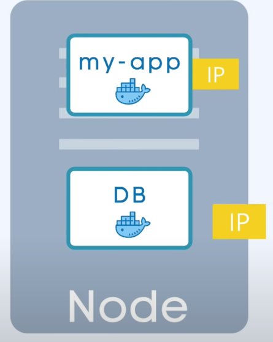

## Kubernetes main component

### Node and Pod

가상머신 노드에 기본적인 타입은 pod입니다. 웹 서버와 데이터베이스 컨테이너를 함께 묶어서 팟으로 실행할 수 있습니다.

pod은 컨테이너를 추상화한 개념으로서, 하나 이상의 컨테이너를 함께 묶어서 실행하는 가장 작은 단위입니다.

보통 1개의 앱서비스에 1Pod이 있어 각 Pod마다 고유의 IP어드레스를 갖고 있습니다.

Node안에 app과 db가 존재하며 IP어드레스를 알고 있어 소통이 가능합니다.

***하지만 팟은 일시적인 특성 때문에 데이터가 금방 손실될 수 있습니다.***
New IP address 할당하는 이유입니다.